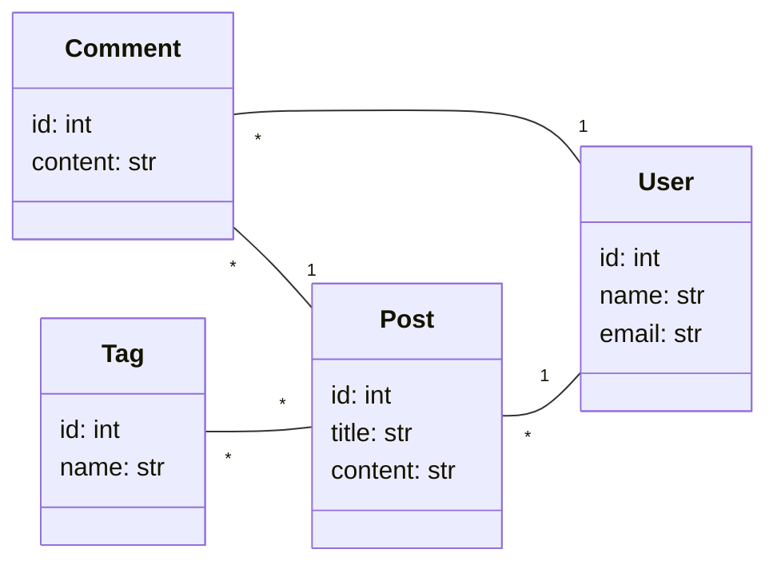

# Aplicação Blog

## Diagrama de Classes UML

```mermaid
classDiagram
    direction RL
    class User {
        id: int
        name: str
        email: str
    }
    class Post {
        id: int
        title: str
        content: str
    }
    class Comment {
        id: int
        content: str
    }
    class Tag {
        id: int
        name: str
    }

    User "1" -- "*" Post
    Post "1" -- "*" Comment
    User "1" -- "*" Comment
    Post "*" -- "*" Tag
```

